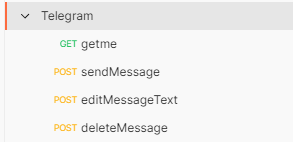
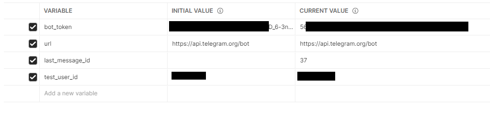

# Postman solution

## Steps

1. Created a collection for API tests



2. Created variables collection



3. API authorization request for the created bot

+ Used [getMe](https://core.telegram.org/bots/api#getme) API method


+ Created tests

```javascript
    pm.test("Status code is 200", function () {
        pm.response.to.have.status(200);
    });
    
    var jsonData = pm.response.json();
    
    pm.test("Check ok or not", function () {
        pm.expect(jsonData.ok).to.eql(true);
    });
    
    pm.test("Check sender id", function () {
        pm.expect(jsonData.result.id).to.eql(5623238635);
    });
    
    pm.test("Check is bot", function () {
        pm.expect(jsonData.result.is_bot).to.eql(true);
    });
    
    
    pm.test("Check sender first name", function () {
        pm.expect(jsonData.result.first_name).to.eql("testing_monkey");
    });
    
    pm.test("Check sender username", function () {
        pm.expect(jsonData.result.username).to.eql("testing_monke_bot");
    });
    
    pm.test("Check sender can join groups", function () {
        pm.expect(jsonData.result.can_join_groups).to.eql(true);
    });
    
    pm.test("Check sender can join groups negative", function () {
        pm.expect(jsonData.result.can_join_groups).not.to.eql(false);
    });
    
    pm.test("Check sender can read all group messages", function () {
        pm.expect(jsonData.result.can_read_all_group_messages).to.eql(false);
    });
    
    pm.test("Check sender can read all group messages negative", function () {
        pm.expect(jsonData.result.can_read_all_group_messages).not.to.eql(true);
    });
    
    pm.test("Check sender supports inline queries", function () {
        pm.expect(jsonData.result.supports_inline_queries).to.eql(false);
    });
    
    pm.test("Check sender supports inline queries negative", function () {
        pm.expect(jsonData.result.supports_inline_queries).not.to.eql(true);
    });
```

3. API send message request

+ Used [sendMessage](https://core.telegram.org/bots/api#sendmessage) API method


+ Created tests

```javascript
    pm.test("Status code is 200", function () {
        pm.response.to.have.status(200);
    });
    
    var jsonData = pm.response.json();
    
    pm.collectionVariables.set("last_message_id", jsonData.result.message_id);
    
    pm.test("Sender id", function () {
        pm.expect(jsonData.result.from.id).to.eql(5623238635);
    });
    
    pm.test("Sender is bot", function () {
        pm.expect(jsonData.result.from.is_bot).to.eql(true);
    });
    
    pm.test("Sender first name", function () {
        pm.expect(jsonData.result.from.first_name).to.eql("testing_monkey");
    });
    
    pm.test("Sender username", function () {
        pm.expect(jsonData.result.from.username).to.eql("testing_monke_bot");
    });
    
    pm.test("Check user first name", function () {
        pm.expect(jsonData.result.chat.first_name).to.eql("Alex̷͍͉̤͆̑̌͒͝ander");
    });
    
    pm.test("Check user last name", function () {
        pm.expect(jsonData.result.chat.last_name).to.eql("Konukђov");
    });
    
    pm.test("Check user username", function () {
        pm.expect(jsonData.result.chat.username).to.eql("Lexx_042");
    });
    
    pm.test("Message type", function () {
        pm.expect(jsonData.result.chat.type).to.eql("private");
    });
    
    pm.test("Text sent", function () {
        pm.expect(jsonData.result.text).to.eql("There is no truth in flesh, only betrayal");
    });
    
    pm.test("Check id sent", function () {
        pm.expect(jsonData.result.from.id).to.eql(5623238635);
    });
```

4. API edit message text request

+ Used [editMessageText](https://core.telegram.org/bots/api#editmessagetext) API method


+ Created tests

```javascript
    pm.test("Status code is 200", function () {
        pm.response.to.have.status(200);
    });

    var jsonData = pm.response.json();

    pm.test("Sender id", function () {
        pm.expect(jsonData.result.from.id).to.eql(5623238635);
    });

    pm.test("Sender is bot", function () {
        pm.expect(jsonData.result.from.is_bot).to.eql(true);
    });

    pm.test("Sender first name", function () {
        pm.expect(jsonData.result.from.first_name).to.eql("testing_monkey");
    });

    pm.test("Sender username", function () {
        pm.expect(jsonData.result.from.username).to.eql("testing_monke_bot");
    });

    pm.test("Check user first name", function () {
        pm.expect(jsonData.result.chat.first_name).to.eql("Alex̷͍͉̤͆̑̌͒͝ander");
    });

    pm.test("Check user last name", function () {
        pm.expect(jsonData.result.chat.last_name).to.eql("Konukђov");
    });

    pm.test("Check user username", function () {
        pm.expect(jsonData.result.chat.username).to.eql("Lexx_042");
    });

    pm.test("Message type", function () {
        pm.expect(jsonData.result.chat.type).to.eql("private");
    });

    pm.test("Text edited", function () {
        pm.expect(jsonData.result.text).to.eql("newermind");
    });

    pm.test("Check id sent", function () {
        pm.expect(jsonData.result.from.id).to.eql(5623238635);
    });
```

+ Created Pre-required Script

```javascript
const postRequest = {
  url: pm.collectionVariables.get("url") + pm.collectionVariables.get("bot_token") + "/sendMessage",
  method: 'POST',
  header: {
    'Content-Type': 'application/json'
  },
  body: {
    mode: 'raw',
    raw: JSON.stringify({ chat_id: pm.collectionVariables.get("test_user_id"), text: "hello" })
  }
};

pm.sendRequest(postRequest, (error, response) => {
  console.log(error ? error : response.json());

  pm.test('response should be okay to process', () => {
    pm.expect(error).to.equal(null);
    pm.expect(response).to.have.property('code', 200);
  });

  var jsonData = response.json();
  pm.collectionVariables.set("last_message_id", jsonData.result.message_id);
});
```

5. API delete message request

+ Used [deleteMessage](https://core.telegram.org/bots/api#deletemessage) API method


+ Created tests

```javascript
    pm.test("Status code is 200", function () {
        pm.response.to.have.status(200);
    });
    
    var jsonData = pm.response.json();
    
    pm.test("Check is result ok", function () {
        pm.expect(jsonData.ok).to.eql(true);
    });
    
    pm.test("Check result", function () {
        pm.expect(jsonData.result).to.eql(true);
    });
    
    pm.test("Check result negative", function () {
        pm.expect(jsonData.result).not.to.eql(false);
    });
```

+ Created Pre-required Script

```javascript
const postRequest = {
  url: pm.collectionVariables.get("url") + pm.collectionVariables.get("bot_token") + "/sendMessage",
  method: 'POST',
  header: {
    'Content-Type': 'application/json'
  },
  body: {
    mode: 'raw',
    raw: JSON.stringify({ chat_id: pm.collectionVariables.get("test_user_id"), text: "hello" })
  }
};

pm.sendRequest(postRequest, (error, response) => {
  console.log(error ? error : response.json());

  pm.test('response should be okay to process', () => {
    pm.expect(error).to.equal(null);
    pm.expect(response).to.have.property('code', 200);
  });

  var jsonData = response.json();
  pm.collectionVariables.set("last_message_id", jsonData.result.message_id);
});
```
